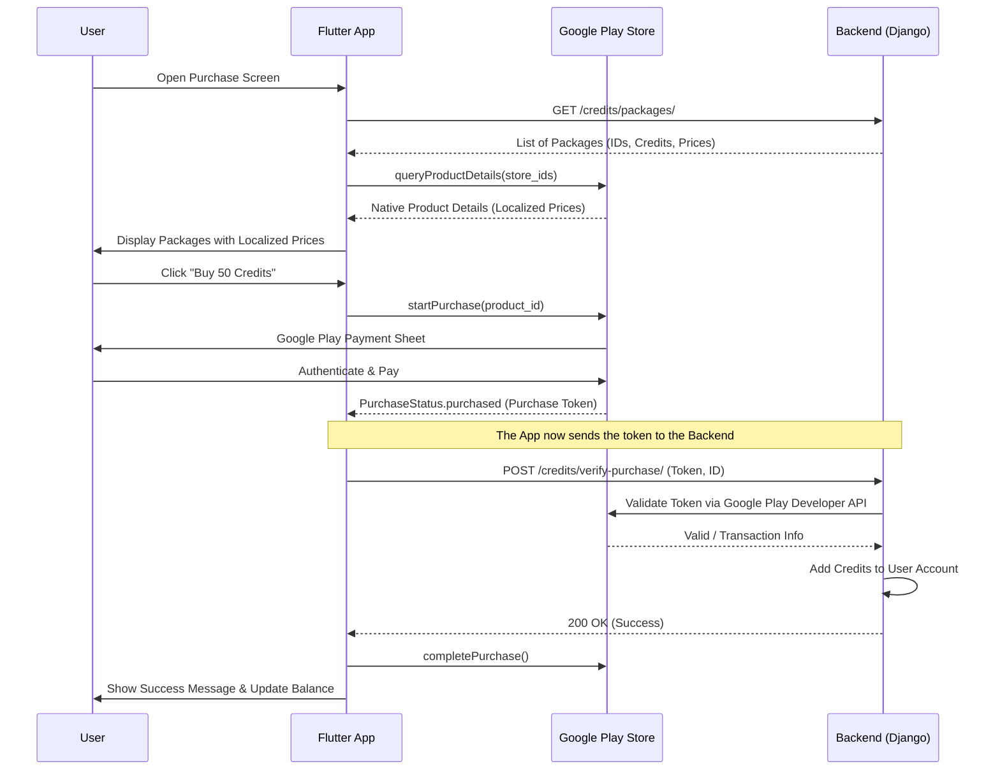

# In-App Purchase (IAP) Integration Guide

This guide explains the step-by-step integration of In-App Purchases for the MiniStori app, including configurations for Google Play Console, Google Cloud, and the internal purchase flow.

---

## High-Level Architecture Diagram



---

## 1. Google Cloud Console Setup (Backend)

The backend needs permission to talk to Google Play to verify purchase tokens.

1.  **Create a Project:** Go to [Google Cloud Console](https://console.cloud.google.com/).
2.  **Enable API:** Search for and enable the **"Google Play Android Developer API"**.
3.  **Create Service Account:**
    *   Go to **IAM & Admin > Service Accounts**.
    *   Create a new Service Account (e.g., `iap-verifier@your-project.iam.gserviceaccount.com`).
    *   **Create Key:** Generate a **JSON key** for this service account. Download it securely; your backend uses this for authentication.
4.  **Copy Email:** Copy the Service Account email address for the next step.

---

## 2. Google Play Console Configuration

1.  **Invite Service Account:**
    *   Go to **Users and Permissions > Invite new users**.
    *   Paste the Service Account email from Step 1.
    *   **Permissions:** Under "App permissions," add your app and give at least:
        *   View financial data, orders, and survey response reports.
        *   Manage orders and subscriptions.
2.  **Create In-App Products:**
    *   Go to **Monetize > Products > In-app products**.
    *   Click **Create product**.
    *   **Product ID:** Use a clear name (e.g., `credits_50_pack`). This must match the `google_product_id` in your backend database.
    *   **Type:** Select **"One-time product"** (not subscription).
    *   Set price and description, then **Activate**.

---

## 3. Flutter App Integration

The app uses the `in_app_purchase` package. The core flow is managed in `lib/api/purchase_service.dart`.

### Step A: Fetching Packages
Instead of hardcoding IDs, the app fetches them from the backend:
```dart
final response = await apiClient.dio.get('credits/packages/');
// Results in a list of CreditPackage objects containing google_product_id
```

### Step B: The Purchase Flow
1.  **Store Query:** The app asks Google Play for the details (name, localized price) of the IDs fetched from the backend.
2.  **Initiate Purchase:**
    ```dart
    final PurchaseParam purchaseParam = PurchaseParam(productDetails: storeProduct);
    await InAppPurchase.instance.buyConsumable(purchaseParam: purchaseParam);
    ```
3.  **Update Listener:** The app listens to `purchaseStream`. When it detects `PurchaseStatus.purchased`:
    *   It extracts the `purchaseToken` (verification data).
    *   It sends it to the backend endpoint `/credits/verify-purchase/`.

---

## 4. Backend Verification Flow

When the backend receives a `verify-purchase` request:

1.  **Auth:** It uses the Service Account JSON key to authenticate with Google.
2.  **Verification:** It calls the Google Play Developer API:
    `GET https://androidpublisher.googleapis.com/androidpublisher/v3/applications/{packageName}/purchases/products/{productId}/tokens/{token}`
3.  **Credit Award:** If Google returns a `purchaseState: 0` (Purchased), the backend:
    *   Checks if this `transaction_id` or `token` has been processed before (prevents double-spending).
    *   Identifies the user from the request headers.
    *   Increments the user's credit balance.
4.  **Acknowledgment:** After the backend returns success, the Flutter app calls `completePurchase()` on the store to consume the item, allowing it to be bought again.

---

## 5. Security Checklist

*   **Server-Side Verification:** NEVER award credits directly in the app. The app can be manipulated. Only the backend can verify the token with Google.
*   **Prevent Replay Attacks:** Store every `purchaseToken` in a database. If the same token is sent again, reject it.
*   **Environment Check:** Ensure the backend points to the correct package name and Google Cloud project during testing.
